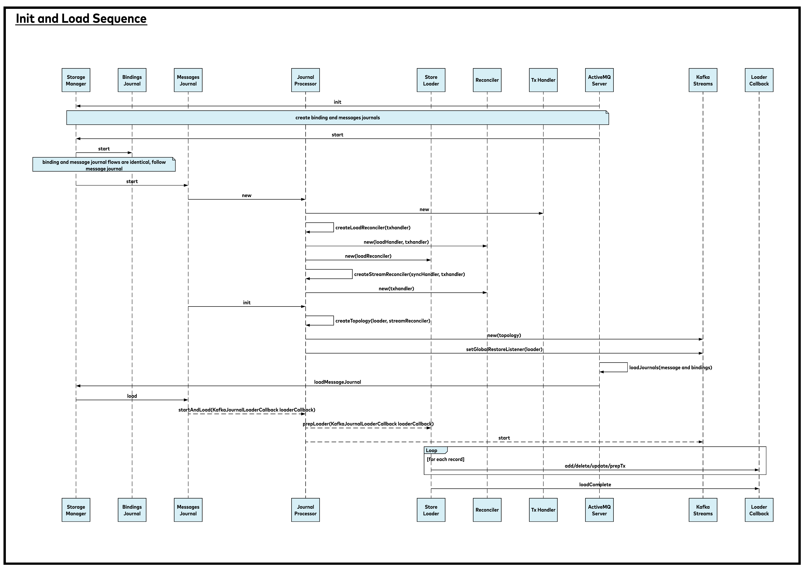
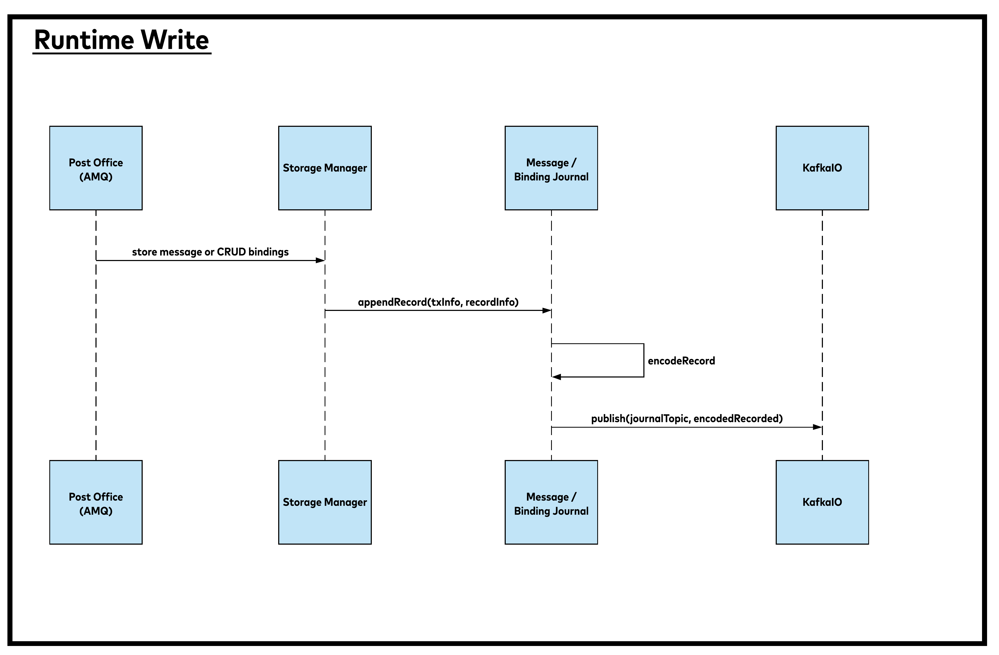
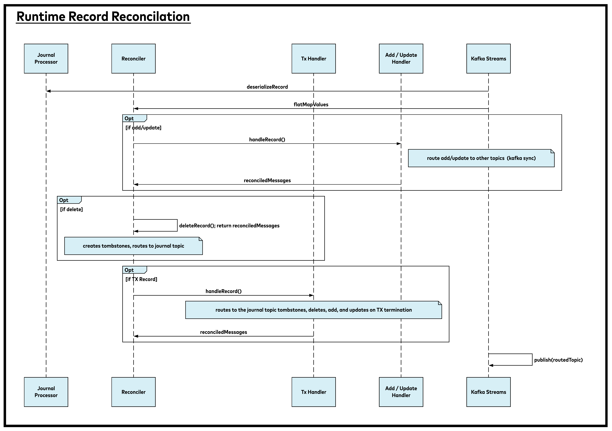

# Design

## Journal Flows

### Initilization and Loading

    participant storeManager as "Storage Manager"
    participant bindingsJournal as "Bindings Journal"
    participant messageJournal as "Messages Journal"
    participant kprocessor as "Journal Processor"
    participant kloader as "Store Loader"
    participant kreconcile as "Reconciler"
    participant txhandler as "Tx Handler"
    participant amqServer as "ActiveMQServer"
    participant streams as "Kafka Streams"
    participant loaderCallback as "Loader Callback"

    amqServer -> storeManager: init
    note over amqServer, storeManager: create binding and messages journals

    amqServer -> storeManager: start
    storeManager -> bindingsJournal: start
    note over storeManager, bindingsJournal: binding and message journal flows are identical, follow message journal

    storeManager -> messageJournal: start
    messageJournal -> kprocessor: new
    kprocessor -> txhandler: new
    kprocessor -> kprocessor: createLoadReconciler(txhandler)
    kprocessor -> kreconcile: new(loadHandler, txhandler)
    kprocessor -> kloader: new(loadReconciler)
    kprocessor -> kprocessor: createStreamReconciler(syncHandler, txhandler)
    kprocessor -> kreconcile: new(txhandler)

    messageJournal -> kprocessor: init
    kprocessor -> kprocessor: createTopology(loader, streamReconciler)
    kprocessor -> streams: new(topology)
    kprocessor -> streams: setGlobalRestoreListener(loader)

    amqServer -> amqServer: loadJournals(message and bindings)
    amqServer -> storeManager: loadMessageJournal
    storeManager -> messageJournal: load
    messageJournal --> kprocessor: startAndLoad(KafkaJournalLoaderCallback loaderCallback)
    kprocessor --> kloader: prepLoader(KafkaJournalLoaderCallback loaderCallback)
    kprocessor --> streams: start

    loop for each record
    kloader -> loaderCallback: add/delete/update/prepTx 
    end

    kloader -> loaderCallback: loadComplete
    

### Runtime Writing

    participant po as "Post Office (AMQ)"
    participant storeManager as "Storage Manager"
    participant journal as "Message / Binding Journal"
    participant kafkaIo as KafkaIO
    po -> storeManager: store message or CRUD bindings
    storeManager -> journal: appendRecord(txInfo, recordInfo)
    journal -> journal: encodeRecord
    journal -> kafkaIo: publish(journalTopic, encodedRecorded)
   

### Runtime Reconciliation

    participant kprocessor as "Journal Processor"
    participant kreconcile as "Reconciler"
    participant txHandler as "Tx Handler"
    participant msgHandler as "Add / Update Handler"
    participant streams as "Kafka Streams"
    streams -> kprocessor: deserializeRecord
    streams -> kreconcile: flatMapValues
    opt if add/update
    kreconcile -> msgHandler: handleRecord()
    note right of msgHandler: route add/update to other topics  (kafka sync)
    kreconcile <- msgHandler: reconciledMessages
    end
    opt if delete
    kreconcile -> kreconcile: deleteRecord(); return reconciledMessages 
    note over kreconcile: creates tombstones, routes to journal topic
    end
    opt if TX Record
    kreconcile -> txHandler: handleRecord()
    note over txHandler: routes to the journal topic tombstones, deletes, add, and updates on TX termination
    kreconcile <- txHandler: reconciledMessages
    end
    streams -> streams: publish(routedTopic)
    

