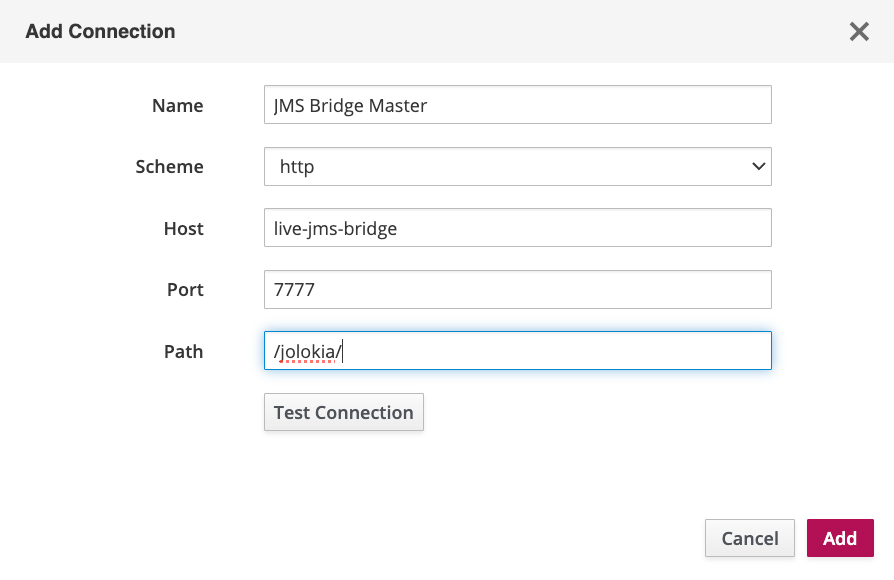

## Background

Standalone Artemis MQ server comes with web server and Artemis Console that enables monitoring and operations directly
on the server. However, when Artemis is embedded in a Java application, the console is not available. The following
steps allow to re-enable and attach external HawtIO or Artemis Console to JMS Bridge.

As Artemis Console is a set of plugins built on top of HawtIO - steps to connect / enable it are same - additional steps
to build the console are described further down.

## Jolokia

Jolokia is a JMX-HTTP bridge giving an alternative to JSR-160 connectors.

Among other installation methods - Java agent based installation is supported - required startup flags are already
included in JMS Bridge startup script.

### Installation

#### Download agent

Download latest version of Jolokia agent
from [Jolokia Maven page](https://repo1.maven.org/maven2/org/jolokia/jolokia-agent-jvm/) and place it in the JMS Bridge
jars directory `JMS_BRIDGE_ROOT/share/java/jms-bridge/`.

#### Set Jolokia related Env variables

Before starting JMS Bridge - set Environment variables for Jolokia Port and Host `JOLOKIA_PORT` and `JOLOKIA_HOST` -
both Env variables have to be set for Agent to be enabled.

`JOLOKIA_HOST` has to be set to the host resolvable from HawtOI / Artemis Console - i.e. it cannot be set to `localhost`
if connecting from remote machine using `jms-bridge-vm1` hostname.

## HawtIO

HawtIO is a modular web console for managing Java applications. It is built on top of Jolokia and provides a set of
plugins for managing Java applications.
[HawtIO get started guide](https://hawtio.github.io/hawtio/getstarted/index.html)

If using vanilla HawtIO - it can be ran as a WAR application within a web server, standalone as a JAR etc, it can be
deployed and ran alongside JMS Bridge on the JMS Bridge host or deployed and ran on separate host / local laptop etc.

### Installation - Standalone Jar

Download latest version of standalone Jar
from [HawtIO sonatype page](https://oss.sonatype.org/content/repositories/public/io/hawt/hawtio-app/)

run using `java -Dhawtio.proxyAllowlist=JMS_BRIDGE_HOST_VM1,JMS_BRIDGE_HOST_VM2 -jar hawtio-app-2.17.7.jar `

or to run it in background process - use:

`nohup java -Dhawtio.proxyAllowlist=JMS_BRIDGE_HOST_VM1,JMS_BRIDGE_HOST_VM2 -jar hawtio-app-2.17.7.jar 2>&1 < /dev/null > hawtio.log &`

Note - replace JMS\_BRIDGE\_HOST\_VM1,JMS\_BRIDGE\_HOST\_VM2 with actual hostnames of JMS Bridge VMs that it's connecting to.

## Artemis Console

Artemis Console is a set of plugins built on top of HawtIO - it can be built and ran standalone or as a WAR application
within a web server.

### Installation - Standalone WAR running through embedded jetty maven plugin

Download Artemis Console WAR
from [Artemis Console Maven page](https://repo1.maven.org/maven2/org/apache/activemq/artemis-console/)

put following pom.xml in the same folder with the WAR file:

```xml
<?xml version="1.0" encoding="UTF-8"?>
<!--
  Licensed to the Apache Software Foundation (ASF) under one or more
  contributor license agreements.  See the NOTICE file distributed with
  this work for additional information regarding copyright ownership.
  The ASF licenses this file to You under the Apache License, Version 2.0
  (the "License"); you may not use this file except in compliance with
  the License.  You may obtain a copy of the License at

  http://www.apache.org/licenses/LICENSE-2.0

  Unless required by applicable law or agreed to in writing, software
  distributed under the License is distributed on an "AS IS" BASIS,
  WITHOUT WARRANTIES OR CONDITIONS OF ANY KIND, either express or implied.
  See the License for the specific language governing permissions and
  limitations under the License.
-->
<project xmlns="http://maven.apache.org/POM/4.0.0" xmlns:xsi="http://www.w3.org/2001/XMLSchema-instance"
         xsi:schemaLocation="http://maven.apache.org/POM/4.0.0 http://maven.apache.org/maven-v4_0_0.xsd">
    <modelVersion>4.0.0</modelVersion>

    <groupId>org.apache.activemq</groupId>
    <artifactId>artemis-console-war</artifactId>
    <version>2.36.0</version>
    <packaging>war</packaging>
    <name>ActiveMQ Artemis Console War</name>

    <dependencies>
    </dependencies>

    <build>
        <plugins>
            <plugin>
                <groupId>org.eclipse.jetty</groupId>
                <artifactId>jetty-maven-plugin</artifactId>
                <version>10.0.22</version>
                <configuration>
                    <deployMode>EMBED</deployMode>
                    <scan>10</scan>
                    <contextHandlers>
                        <contextHandler implementation="org.eclipse.jetty.maven.plugin.MavenWebAppContext">
                            <war>artemis-console-2.36.0.war</war>
                            <contextPath>/console</contextPath>
                        </contextHandler>
                    </contextHandlers>
                    <modules>
                        <module>jmx</module>
                    </modules>
                    <systemProperties>
                        <hawtio.authenticationEnabled>false</hawtio.authenticationEnabled>
                        <hawtio.disableProxy>false</hawtio.disableProxy>
                        <hawtio.proxyAllowlist>JMS_BRIDGE_VM1,JMS_BRIDGE_VM2</hawtio.proxyAllowlist>
                    </systemProperties>
                </configuration>
            </plugin>
        </plugins>
    </build>
</project>
```

Making sure to update the `<war>artemis-console-2.36.0.war</war>` to correct filename (if versions differ) and
`<hawtio.proxyAllowlist>JMS_BRIDGE_VM1,JMS_BRIDGE_VM2</hawtio.proxyAllowlist>` to actual JMS Bridge VM hostnames -
generally those will match `JOLOKIA_HOST` env vars set on those VMs.

Then run `mvn jetty:run` from the same directory as the WAR file and pom.xml - this will start embedded Jetty server and
deploy the WAR file.

Navigate to `http://host:8080/console` to open the Artemis Console - for example if running on local machine - that will
be `http://localhost:8080/console`

## Connect Hawtio / Artemis Console to the Jolokia endpoints on the JMS Bridge VMs

On the HawtIO / Artemis Console landing page - click `Add Connection` and fill in as follows:

* Name: JMS Bridge VM1 (or Master etc)
* Scheme: HTTP
* Host: JMS\_BRIDGE\_VM1 (actual host)
* Port: JOLOKIA\_PORT (actual port)
* Path: /jolokia/

Test Connection to verify.

Click `Add` to save.

Example for JMS Bridge Master deployed on `live-jms-bridge` host and JOLOKIA Port of 7777


Once connection is saved - click on the Connect button to open the JMS Bridge monitoring page.
