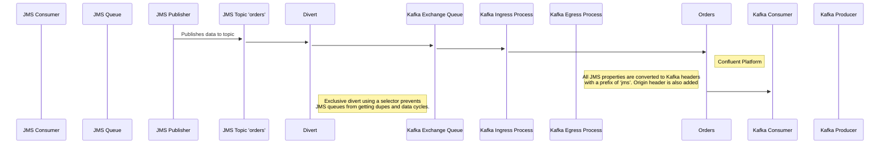
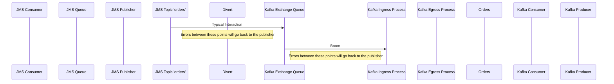
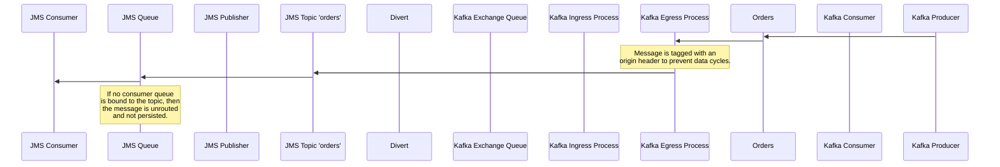
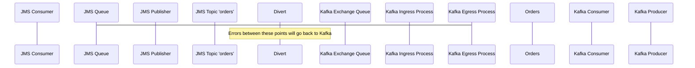

## JMS Producer to Kafka Consumer Flow

```mermaid
sequenceDiagram
    participant JMS Consumer
    participant JMS Queue
    participant JMS Publisher
    participant JMS Topic 'orders'
    participant Divert
    participant Kafka Exchange Queue
    participant Kafka Ingress Process
    participant Kafka Egress Process
    participant Orders
    participant Kafka Consumer
    participant Kafka Producer

    JMS Publisher->>+JMS Topic 'orders': Publishes data to topic
    JMS Topic 'orders'->>+Divert : 

    Divert ->>+Kafka Exchange Queue: 
    Kafka Exchange Queue->>+Kafka Ingress Process: 
    Kafka Ingress Process->>Orders: 
    Note right of Orders: Confluent Platform
    Note left of Orders: All JMS properties are converted to Kafka headers <br/>with a prefix of ‘jms’. Origin header is also added
    Orders->>+Kafka Consumer: 
    Note right of Divert: Exclusive divert using a selector prevents <br/>JMS queues from getting dupes and data cycles.
```

## JMS Producer to Kafka Consumer Flow - Error Flow

```mermaid
sequenceDiagram
    participant JMS Consumer
    participant JMS Queue
    participant JMS Publisher
    participant JMS Topic 'orders'

    participant Divert
    participant Kafka Exchange Queue

    participant Kafka Ingress Process
    participant Kafka Egress Process
    participant Orders

    participant Kafka Consumer
    participant Kafka Producer
    JMS Topic 'orders'->>Kafka Exchange Queue: Typical Interaction
    note over Divert: Errors between these points will go back to the publisher
    Kafka Exchange Queue->>Kafka Ingress Process: Boom
    note left of Kafka Ingress Process: Errors between these points will go back to the publisher
```

## Kafka Producer to JMS Consumer Flow

```mermaid
sequenceDiagram
    participant JMS Consumer
    participant JMS Queue
    participant JMS Publisher
    participant JMS Topic 'orders'

    participant Divert
    participant Kafka Exchange Queue

    participant Kafka Ingress Process
    participant Kafka Egress Process
    participant Orders

    participant Kafka Consumer
    participant Kafka Producer

    Kafka Producer->>Orders: 
    Orders->>Kafka Egress Process: 
    note over Kafka Egress Process: Message is tagged with an <br/> origin header to prevent data cycles.

    Kafka Egress Process->>JMS Topic 'orders': 

    JMS Topic 'orders'->>JMS Queue: 

    JMS Queue->>JMS Consumer: 

    Note over JMS Queue: If no consumer queue <br/> is bound to the topic, then <br/> the message is unrouted <br/> and not persisted.
```

## Kafka Producer to JMS Consumer - Error Flow

```mermaid
sequenceDiagram
    participant JMS Consumer
    participant JMS Queue
    participant JMS Publisher
    participant JMS Topic 'orders'

    participant Divert
    participant Kafka Exchange Queue

    participant Kafka Ingress Process
    participant Kafka Egress Process
    participant Orders

    participant Kafka Consumer
    participant Kafka Producer

    Kafka Egress Process->JMS Queue: 
    Note over Divert: Errors between these points will go back to Kafka
```
