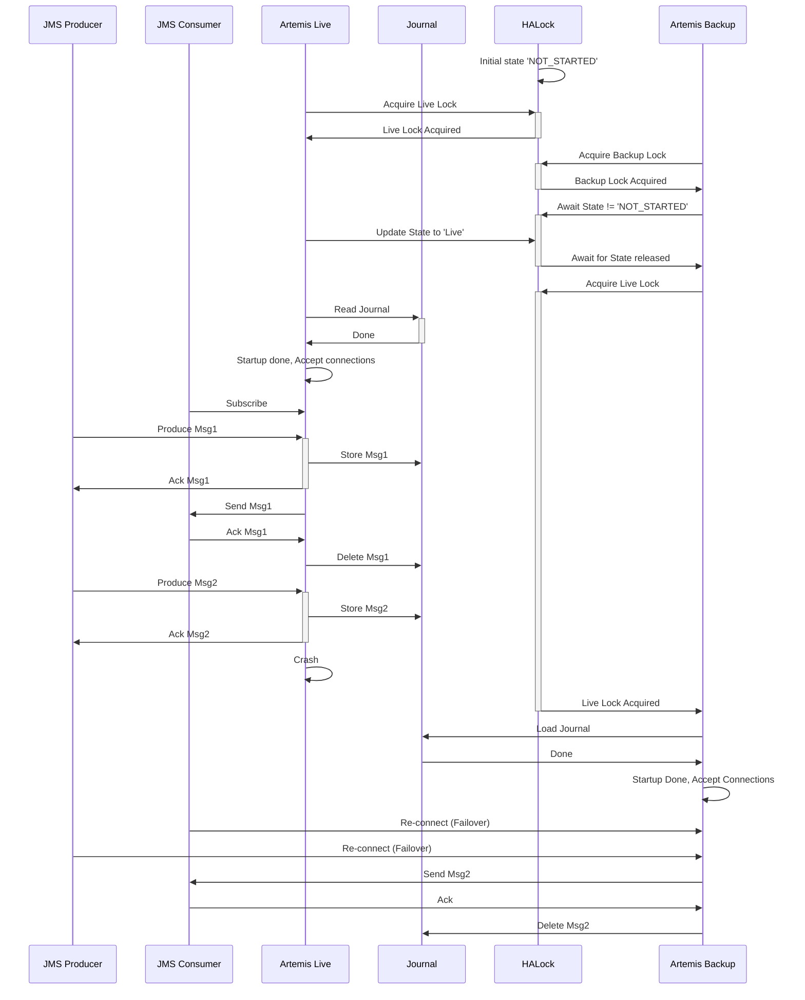

## Summary

High availability is a feature that allows the JMS Bridge to continue to operate even if one of the nodes in the cluster fails. This is achieved by having a standby node that can take over the work of the failed node. 

Implementation is based on Artemis Shared Store Master-Slave high availability mode with important difference of shared filesystem store replaced by Kafka Streams based shared journal and Kafka Consumer Membership protocol replacing file based locks.

## High Availability Architecture
JMS Bridge re-uses Shared Store activations of Artemis - but instead of using shared filesystem - Kafka Streams stateful Journal that is solely dependent on Kafka is used for Journaling operations and File based locks are replaced by Kafka Consumer Group Membership protocol - the actual flow of operations stays exactly the same.

Typical startup and failover process in Primary / Backup HA setup:

