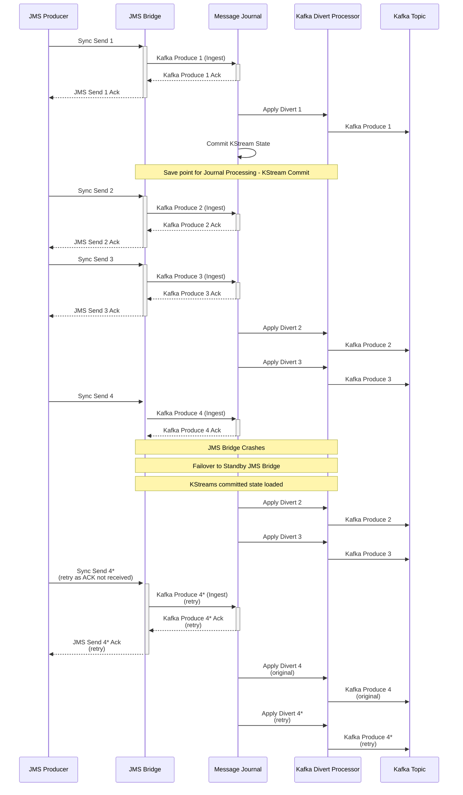
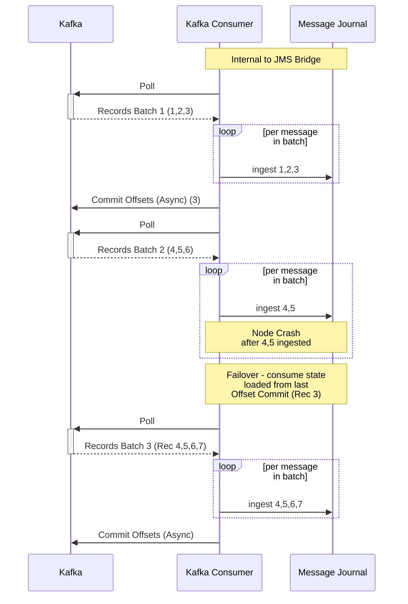

## JMS Destination to Kafka Topic Egress - Processing on Crash Flow

Following flow highlights limitation that asynchronous processing of divert in Kafka Streams based message journal can have upon crash of JMS Bridge node.
Kafka Streams processing state is saved periodically (known as Commit) and upon crash, the state is restored from the last commit point. Due to this, messages can be re-produced to Kafka Topics after JMS Bridge node crash - causing duplication on Kafka Topics only.

Sequence diagram below illustrates a flow where:
- Message 1 is sent by JMS Producer
- Message 1 is ingested into Journal
- Message 1 is Acked back to JMS Producer
- Message 1 is diverted to Kafka
- KStreams state committed
- Messages 2,3 are ingested into Journal
- Messages 2,3 are Acked back to JMS Producer
- Messages 2,3 are diverted to Kafka
- Message 4 is sent by JMS Producer
- Message 4 is ingested into Journal
- JMS Bridge crashes
- Standby JMS Bridge takes over
- KStreams state is restored from last commit point 
- Messages 2,3 are re-processed and diverted to Kafka again (causing duplicates on Kafka Topic)
- Message 4 is diverted to Kafka
- JMS Producer sends Message 4* again (retry as Ack was not returned from JMS Bridge due to crash even though message was persisted to Journal)
- Message 4* is ingested into Journal again (retry - duplicate on JMS Queue / Topic)
- Message 4* is Acked back to JMS Producer (retry)
- Message 4* is diverted to Kafka (retry - duplicate on Kafka Topic)

The handling of Message 4 is consistent with Vanilla Artemis and guarantees in Sync send mode, but duplication caused by reprocessing divert for messages 2 and 3 are side effects of Kafka Streams processing and asynchronous state commit.

## Kafka Topic to JMS Destination Ingress - Processing on Crash Flow

Following flow highlights limitation that asynchronous processing of divert in Kafka Streams based message journal can have upon crash of JMS Bridge node.
Kafka Streams processing state is saved periodically (known as Commit) and upon crash, the state is restored from the last commit point. Due to this, messages can be re-produced to Kafka Topics after JMS Bridge node crash - causing duplication on Kafka Topics only.

Sequence diagram below illustrates a flow where:
- JMS Bridge Ingress Kafka Consumer polls Kafka Topic for records to route into JMS
- Records Batch is returned from Kafka Topic containing records 1,2,3
- For each record in the batch - record processed into JMS Destination (and Message Journal)
- Kafka Offsets committed for the record batch
- Kafka Polled for more records
- Seconds Records Batch is returned from Kafka Topic containing records 4,5,6
- For each record in the batch - record processed into JMS Destination (and Message Journal)
- JMS Bridge node crashes part way through processing record batch - so 4,5 are processed but 6 is not yet and offsets not committed
- Standby JMS Bridge takes over (or node is restarted)
- Ingress Kafka Consumer resubscribes to Kafka Topic and resumes from last committed offset (3)
- Kafka Polled for more records
- Third Records Batch is returned from Kafka Topic containing records 4,5,6,7
- Messages 2,3 are re-processed and diverted to Kafka again (causing duplicates on Kafka Topic)
- For each record in the batch - record processed into JMS Destination (and Message Journal)
- Records 4,5 are duplicated as they were re-consumed.
The number of re-consumed messages will depend on exact timing of a crash and record batch sizing.
