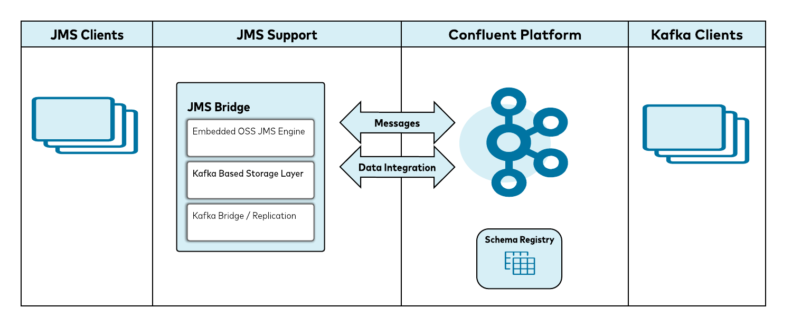

Connect legacy JMS based applications to the Confluent Platform without major modifications.

## Overview

The JMS-Bridge is a component that can be used to facilitate quicker migration from legacy JMS based systems to ones built around the Confluent Platform. It is quite common for enterprise systems to use JMS as a means of integrating external applications to a central system. These applications are usually not maintained by the system owners but by external teams which may not share the same goals or priorities of the system team. This creates a problem when the system team wants to migrate away from their legacy JMS vendor to the Confluent Platform since it would require updating all of those external clients.

Easing this transition is the goal of the JMS-Bridge. By providing a fully compliant JMS 2.0 implementation of the client jars and a server side component it can accommodate the existing patterns of those external JMS applications. With tight integration to the Confluent Platform all JMS originated topic data will be available in Kafka and all Kafka topic data will be available in JMS topics. Since the JMS-Bridge is built on top of the Confluent Platform, using it as it's storage mechanism, it does not require additional disk space or SAN provisioning, if you are monitoring Kafka you are monitoring the JMS-Bridge.

## Features

- Full JMS 2.0 compliance
- All data stored in Kafka
- Full integration of topic data between Kafka and JMS-Bridge
    - Publish from JMS, Consumer from Kafka
    - Publish from Kafka, Consume from JMS

## Benefits

- Transition from JMS to the Confluent Platform with minor updates to existing JMS applications
    - client jar update
- Quickly start innovating using Kafka and the Confluent Platform
  \*Allow ample time to either migrate legacy JMS applications or allow them to naturally fade away