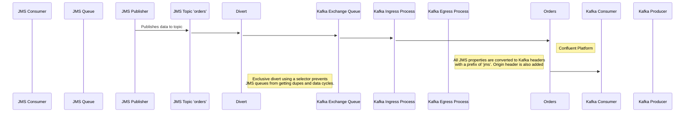

JMS Producer to Kafka Consumer

```mermaid
sequenceDiagram
    participant JMS Consumer
    participant JMS Queue
    participant JMS Publisher
    participant JMS Topic 'orders'

    participant Divert
    participant Kafka Exchange Queue

    participant Kafka Ingress Process
    participant Kafka Egress Process
    participant Orders

    participant Kafka Consumer
    participant Kafka Producer

    JMS Publisher->>+JMS Topic 'orders': Publishes data to topic
    JMS Topic 'orders'->>+Divert : 

    Divert ->>+Kafka Exchange Queue: 
    Kafka Exchange Queue->>+Kafka Ingress Process: 
    Kafka Ingress Process->>Orders: 
    Note right of Orders: Confluent Platform
    Note left of Orders: All JMS properties are converted to Kafka headers <br/>with a prefix of ‘jms’. Origin header is also added
    Orders->>+Kafka Consumer: 
    Note right of Divert: Exclusive divert using a selector prevents <br/>JMS queues from getting dupes and data cycles.


```
