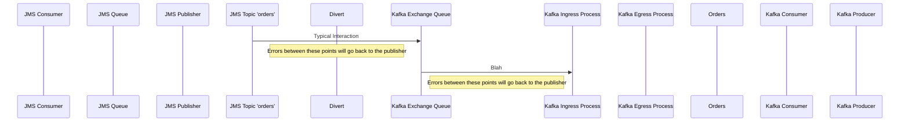

JMS Producer to Kafka Consumer - Error

```mermaid
sequenceDiagram
    participant JMS Consumer
    participant JMS Queue
    participant JMS Publisher
    participant JMS Topic 'orders'

    participant Divert
    participant Kafka Exchange Queue

    participant Kafka Ingress Process
    participant Kafka Egress Process
    participant Orders

    participant Kafka Consumer
    participant Kafka Producer
    JMS Topic 'orders'->>Kafka Exchange Queue: Typical Interaction
    note over Divert: Errors between these points will go back to the publisher
    Kafka Exchange Queue->>Kafka Ingress Process: Blah
    note left of Kafka Ingress Process: Errors between these points will go back to the publisher
```
