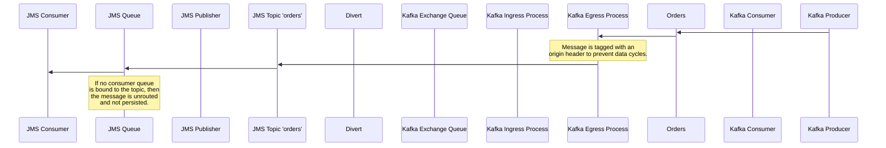

Kafka Producer to JMS Consumer

```mermaid
sequenceDiagram
    participant JMS Consumer
    participant JMS Queue
    participant JMS Publisher
    participant JMS Topic 'orders'

    participant Divert
    participant Kafka Exchange Queue

    participant Kafka Ingress Process
    participant Kafka Egress Process
    participant Orders

    participant Kafka Consumer
    participant Kafka Producer

    Kafka Producer->>Orders: 
    Orders->>Kafka Egress Process: 
    note over Kafka Egress Process: Message is tagged with an <br/> origin header to prevent data cycles.

    Kafka Egress Process->>JMS Topic 'orders': 

    JMS Topic 'orders'->>JMS Queue: 

    JMS Queue->>JMS Consumer: 

    Note over JMS Queue: If no consumer queue <br/> is bound to the topic, then <br/> the message is unrouted <br/> and not persisted.


    
```
