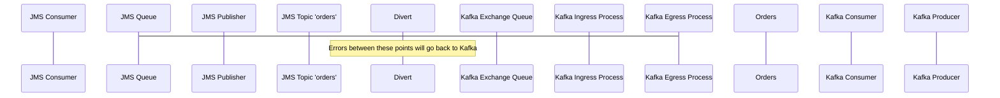

Kafka Producer to JMS Consumer - Error

```mermaid
sequenceDiagram
    participant JMS Consumer
    participant JMS Queue
    participant JMS Publisher
    participant JMS Topic 'orders'

    participant Divert
    participant Kafka Exchange Queue

    participant Kafka Ingress Process
    participant Kafka Egress Process
    participant Orders

    participant Kafka Consumer
    participant Kafka Producer

    Kafka Egress Process->JMS Queue: 
    Note over Divert: Errors between these points will go back to Kafka
```
